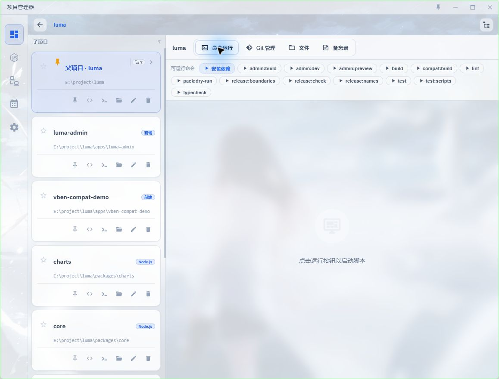
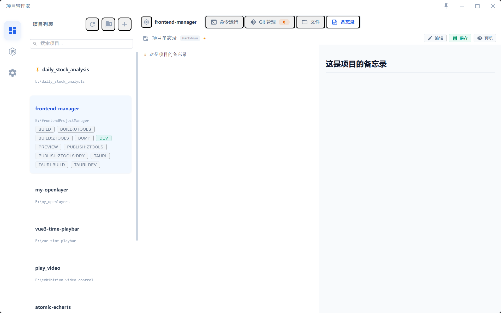
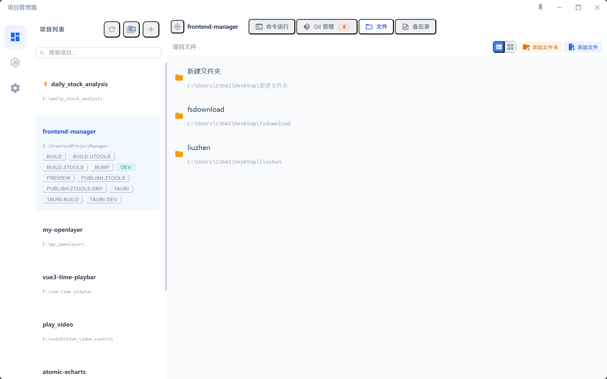
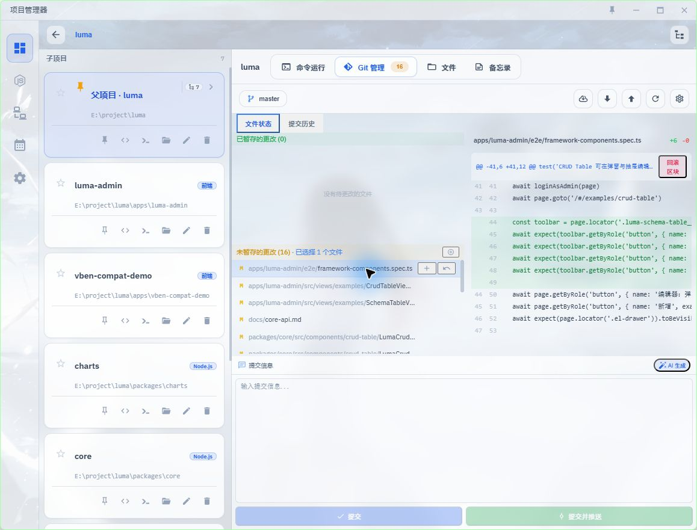
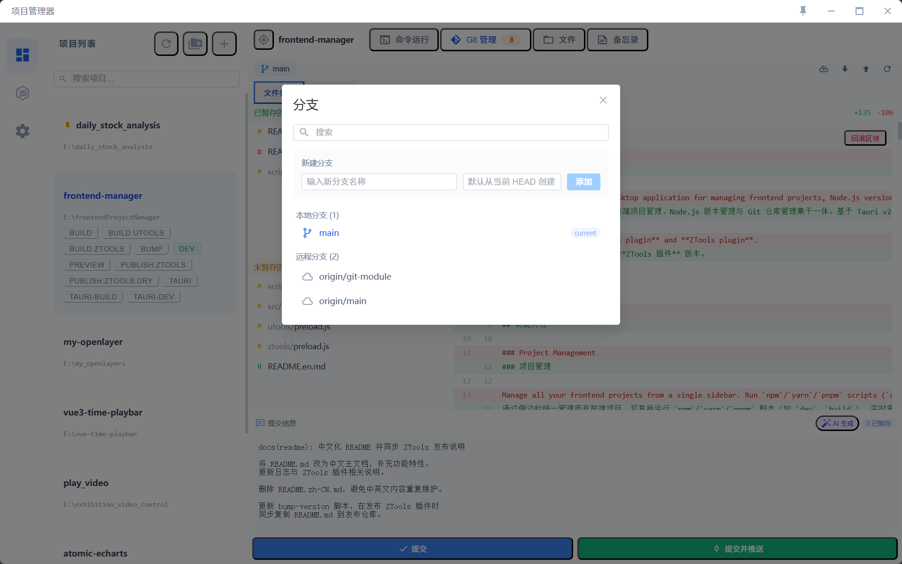
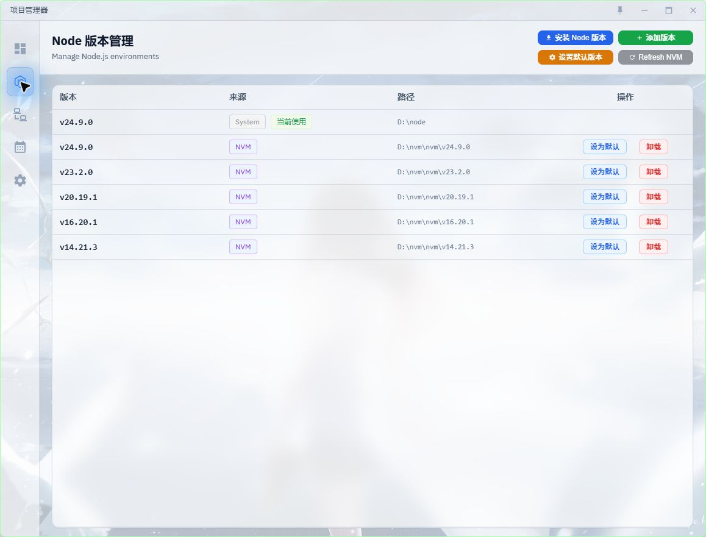
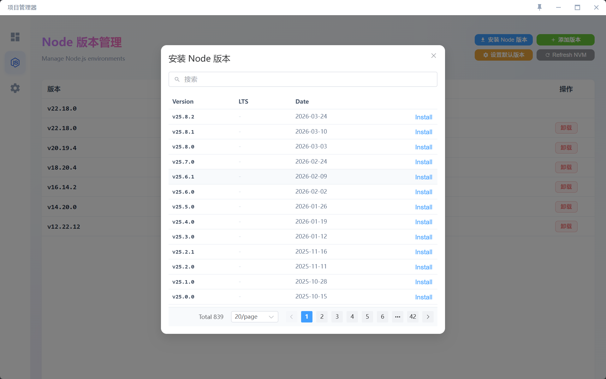
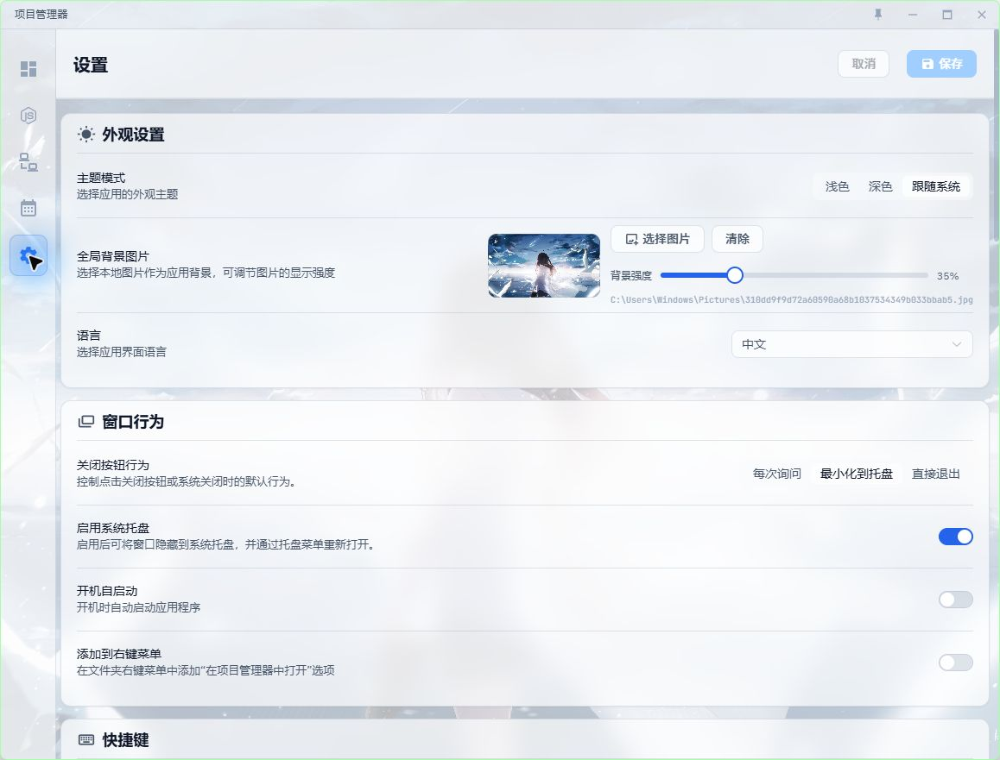

# 项目管理器

一款现代化跨平台桌面应用，将前端项目管理、Node.js 版本管理与 Git 仓库管理集于一体。基于 Tauri v2 + Vue 3 + TypeScript 构建。

同时提供 **uTools 插件** 和 **ZTools 插件** 版本。

---

## 功能特性

### 项目管理

通过侧边栏统一管理所有前端项目，可直接运行 `npm`/`yarn`/`pnpm` 脚本（如 `dev`、`build`），实时查看每个脚本的控制台输出。



- 单个或**批量**添加项目（支持拖拽文件夹导入）
- 自动识别 `package.json` 中的脚本命令，可自定义显示的脚本
- 支持 **Node.js 项目**（npm/yarn/pnpm）和**通用项目**（完全自定义命令）
- 支持**置顶**常用项目，侧边栏一键**定位**当前激活项目
- 支持**拼音搜索**项目名
- 一键在编辑器、终端或文件管理器中打开项目
- **项目备忘录**：为每个项目编写 Markdown 格式的笔记，支持编辑 / 预览 / 分屏模式



- **项目文件管理**：关联项目中的重要文件或文件夹，支持拖拽排序、快速预览图片与文本



---

### Git 管理

内嵌完整 Git 图形界面，采用 SourceTree 风格布局，直接在项目工作区使用。支持初始化新仓库。

#### 文件状态



- 已暂存 / 未暂存 / 未跟踪 / 冲突文件列表，带状态颜色指示
- 暂存、取消暂存、丢弃单个文件或全部文件
- **区块级操作**：对差异中每个 hunk 独立暂存、取消暂存或丢弃
- 文件右键菜单：停止跟踪、添加到 `.gitignore`、恢复文件
- 可调整大小的三栏布局（文件列表 | 差异视图 | 提交区域）

#### 差异查看器

- 基于 diff2html 的语法高亮差异展示
- 支持**逐行对比**与**并排对比**两种模式切换

#### 提交与推送

- 内置提交信息输入框（切换选项卡不丢失内容）
- 一键**提交**或**提交并推送**
- 支持 **AI 自动生成提交信息**（见下方）

#### 提交历史

- **SVG 可视化分支图**：多色泳道展示分支合并拓扑，当前分支优先排列
- 列宽可拖拽调整，横向滚动时表头同步滚动
- HEAD 提交高亮（空心圆点 + 加粗文字），标签 / 分支彩色徽章
- 点击任意提交查看或关闭详细信息，重复选中当前提交不重复刷新
- 从提交历史中**回滚指定区块**到工作区
- 滚动到底部自动加载更多历史记录

#### 分支管理



- 查看本地和远程分支、标签列表
- 切换、新建、重命名、删除（含强制删除）分支
- 合并、变基分支
- 设置上游跟踪分支
- 显示与远程分支的**领先 / 落后**提交数
- 管理标签（检出、删除）

#### 贮藏（Stash）

- 贮藏当前工作区更改（可填写说明）
- 弹出、应用、删除贮藏记录

#### 远程仓库管理

- 工具栏一键拉取、推送（支持**强制推送**）、获取
- 管理多个远程仓库（添加、编辑、删除远程地址）

---

### AI 提交信息生成

基于暂存区差异，使用任意 OpenAI 兼容接口自动生成提交信息。


- 可配置 Base URL、API Key 和模型（支持 OpenAI、DeepSeek、通义千问等）
- 默认提示词遵循 **Conventional Commits** 规范，正文使用中文
- 支持完全自定义提示词模板
- 内置接口连通性测试

---

### Node 版本管理



可视化管理 NVM 安装的 Node.js 版本：

- 安装、卸载、切换 Node.js 版本



- 一键设置**系统默认** Node.js 版本（自动维护环境变量）
- 检测并使用系统已安装的 Node.js（NVM 之外）
- 添加自定义 Node.js 可执行文件路径

---

### 终端与编辑器集成

- 自动检测系统可用终端（CMD、PowerShell、pwsh、Git Bash、Windows Terminal、iTerm2 等）
- 支持添加**自定义终端**可执行文件
- 配置**多个代码编辑器**（如 VS Code、Cursor、WebStorm），项目可**单独指定**打开的编辑器
- 在项目卡片中一键用编辑器、终端或文件管理器打开项目

---

### 设置



| 选项 | 说明 |
|---|---|
| 主题 | 深色 / 浅色 / 跟随系统 |
| 语言 | 简体中文 / English |
| 默认终端 | 自动检测 + 自定义 |
| 编辑器 | 支持多个，项目可独立配置 |
| AI 提交信息 | 配置 OpenAI 兼容接口 |
| 自动更新 | 开启 / 关闭 |
| 开机自启 | 开启 / 关闭 |
| 右键菜单 | 资源管理器集成（仅限 Windows） |
| 数据管理 | 导出 / 导入所有配置，方便备份和迁移 |

---

### uTools / ZTools 插件

本应用同时打包为 **uTools 插件**和 **ZTools 插件**，可在对应启动器中使用完整的项目管理和 Git 功能，无需独立窗口。

---

## 技术栈

| 层级 | 技术 |
|---|---|
| 核心 | Tauri v2, Rust |
| 前端 | Vue 3, TypeScript, Vite |
| UI | Element Plus, UnoCSS（兼容 Tailwind） |
| 状态管理 | Pinia |
| 国际化 | vue-i18n |
| 搜索 | pinyin-pro |
| 差异展示 | diff2html |

---

## 快速开始

```bash
# 安装依赖
npm install

# 开发模式（Tauri 桌面端）
npm run tauri dev

# 构建桌面应用
npm run tauri build

# 构建 uTools 插件
npm run build:utools

# 构建 ZTools 插件
npm run build:ztools
```

---

## 更新日志

### v1.0.5

**优化**

- **大项目性能优化**：项目列表搜索、运行状态统计、控制台日志渲染、Git 面板切换等高频路径整体降载，项目多、修改文件多时切换与恢复显示更流畅
- **Git 按需加载与冷冻机制**：Git 视图改为按需刷新，提交历史延迟加载；窗口隐藏到托盘后冻结 Git 刷新，恢复显示再解冻
- **持久化与重渲染减负**：数据保存改为空闲时合并写入，项目备忘录预览与文件搜索触发链路进一步收敛，减少主线程抖动
- **文件管理体验优化**：文件列表滚动区域增加左右边距，滚动较深时显示“返回顶部”按钮，滚动条拖动和长列表浏览更顺手

**修复**

- **异常退出进程残留**：桌面端与 uTools / ZTools 插件模式补齐异常退出兜底，主程序崩溃或被强制结束时会同步回收运行中的项目进程
- **托盘与退出链路**：修复缩小到托盘后“退出软件”无响应、关闭系统托盘后关闭无反应等问题，并统一退出前清理运行任务
- **开机自启状态校验**：修复自启动配置切换后界面状态可能不准确的问题，设置后会重新读取真实状态
- **Git 历史交互**：提交详情支持关闭，重复点击当前提交不再重复刷新；修复大量提交历史滚动时出现空白区域的问题
- **多语种与界面细节**：补齐遗漏的国际化文案，修复部分按钮显示 key 值的问题，并同步清理已移除的旧交互描述

---

### v1.0.4

**新功能**

- **文件快速预览增强**：支持更多文本类型预览，补充 `geojson` 等格式识别
- **文本编码兼容**：文本预览增加 UTF-8 / GBK / GB18030 / UTF-16 等编码兜底，Windows 中文 `.txt` 文件可直接预览

**优化**

- **文件搜索稳定性**：优化搜索索引构建与释放逻辑，避免异步搜索结果串写和索引长期占用内存
- **弹框样式修复**：统一弹框高度、滚动区域和 Teleport 后样式生效问题，消除多处横向滚动条
- **右键菜单重构**：文件列表右键菜单改为更轻量的玻璃风格，菜单尺寸、边框和悬浮反馈全面优化
- **工具栏视觉升级**：顶部标签、文件区工具栏、Git 工具栏统一为更现代的液态玻璃风格，并补齐深色模式适配
- **插件模式设置页优化**：uTools / ZTools 插件模式下隐藏无效的系统集成模块，设置页改为更自然的单栏布局
- **设置与文件管理细节优化**：修复多个按钮、列表切换和文件操作区域在亮色 / 深色模式下层级不统一的问题

---

### v1.0.3

**新功能**

- **SVG 可视化分支图**：提交历史支持多色泳道拓扑图，直观展示分支合并关系
- **提交历史增强**：可拖拽调整列宽、表头横向同步滚动、HEAD 高亮、彩色分支徽章、复制 Hash
- **区块级操作**：差异视图支持按 hunk 暂存 / 取消 / 丢弃，历史视图支持回滚指定区块
- **贮藏管理**：完整的 Git Stash 支持（贮藏、弹出、应用、删除）
- **标签管理**：查看、检出、删除标签
- **多远程仓库**：支持为仓库配置多个远程地址
- **强制推送 / 设置上游**：在分支操作面板中直接执行
- **并排差异模式**：差异查看器支持逐行与并排两种对比视图切换
- **批量添加项目**：一次选择多个文件夹批量导入
- **ZTools 插件**：新增 ZTools 启动器插件支持

**优化**

- **多编辑器配置**：设置中支持添加多个编辑器，项目可单独指定
- **项目备忘录**：Markdown 格式，支持编辑 / 预览 / 分屏模式
- **项目文件管理**：关联重要文件/文件夹，支持拖拽排序、图片/文本预览
- **深色模式**：修复多处按钮和文字在深色模式下颜色不清晰的问题
- **Git 提交后自动清空差异视图**
- **窗口聚焦时自动刷新** Git 状态

---

## 开源协议

[MIT](LICENSE)
